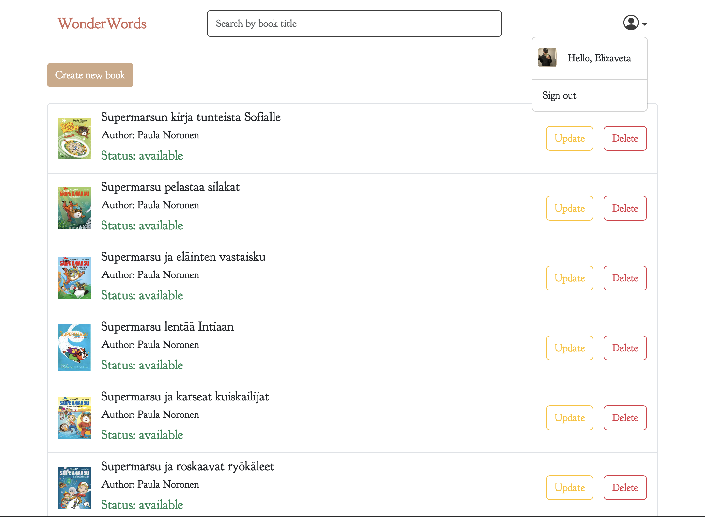
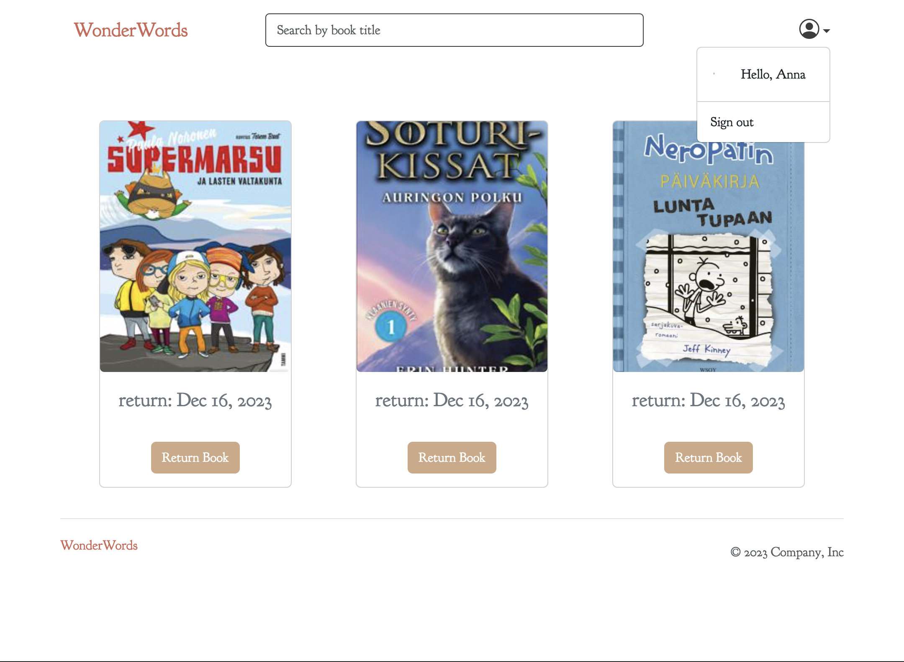

# Library for children "WonderWorl"

This project revolves around the creation of an Libarary system using Angular for the frontend and interactions with an equivalent backend service.

- Frontend: TypeScript, Angular 16, Bootstrap, CSS.
- Backend: Node.js(ExpressJS), MongoDB, Postman.

### 1. Core features

- Guest Functionalities:
  - Books browsing: explore all available books, view books details, search, sort.
  - User account Management: Borrow book to the user, check all borrowed book, and return it back(remove from account).
- User Functionalities
  - User Management: Sign up, log in, and log out. Users have no access to admin panel.
- Admin Functionalities
  - Product Management: View all books from DB, add new book, update existing books, and delete books.

### 2. Additional features

- Related books by the same author(in the book page user also can see the dsame author's book)
- Author page with all books by author
- Add e2e tests using playwright testing (for sign in / sign up / borrow book)
- Add unit testing jasmin/karma (services)

## Prerequisites

- Implement routing and guards to protect certain routes.
- Use angular animation for borrowe book effects
- Properly handle errors, alerts and modal windows for wrong scenario.
- Maintain a well-organized directory structure and naming convention in line with Angular best practices.

## Deploy

- front-end deploy on Firebase []
- back-end deploy on Amazon []

### Getting Started

1. Install dependencies front end project:
   npm install
2. Run the front end project 
   ng serve
3. Install dependencies back end project:
   pnpm install
4. Run the back end project 
   npm run dev
   
### Screenshots

,
,

